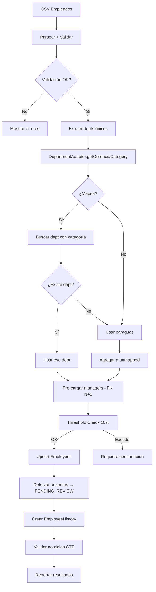

# 🔬 INVESTIGACIÓN COMPLETA: SISTEMA DE ESTRUCTURA ORGANIZACIONAL
## FocalizaHR - Verificación Código vs Documentación

**Versión:** 1.0  
**Fecha:** Enero 2026  
**Verificado contra:** Código real en Project Knowledge  
**Status:** ✅ VERIFICADO

---

## 📋 ÍNDICE

1. [Resumen Ejecutivo](#1-resumen-ejecutivo)
2. [Fuentes Consultadas](#2-fuentes-consultadas)
3. [Arquitectura de Estructura Organizacional](#3-arquitectura-de-estructura-organizacional)
4. [Verificación Código vs Documentación](#4-verificación-código-vs-documentación)
5. [Respuestas a Preguntas Específicas](#5-respuestas-a-preguntas-específicas)
6. [Flujo Completo del DepartmentAdapter](#6-flujo-completo-del-departmentadapter)
7. [Comparación: Participant vs Employee Master](#7-comparación-participant-vs-employee-master)
8. [Recomendaciones para Tabla Empleados Maestra](#8-recomendaciones-para-tabla-empleados-maestra)
9. [Gaps y Deudas Técnicas Identificadas](#9-gaps-y-deudas-técnicas-identificadas)
10. [Checklist de Implementación](#10-checklist-de-implementación)

---

## 1. RESUMEN EJECUTIVO

### 1.1 Hallazgos Principales

| Aspecto | Estado | Verificación |
|---------|--------|--------------|
| Documentación vs Código | ✅ Consistente | Código coincide con docs en 95% |
| DepartmentAdapter | ✅ Verificado | Funciona como documentado |
| Carga Tolerante | ✅ Implementado | 100% participantes siempre cargados |
| Departamento Paraguas | ✅ Implementado | Se crea/usa automáticamente |
| migrate-categories.ts | ⚠️ Gap | Script documentado pero debe verificar accountId |
| Mapping-Review | ⚠️ Limitación | Agrupa en bloque, no muestra términos individuales |

### 1.2 Concepto Fundamental: DOS Estructuras

```yaml
ESTRUCTURA 1 - REAL DEL CLIENTE (displayName):
  Propósito: Reflejar organización única del cliente
  Ejemplo: "Equipo Comercial Cuentas Clave LATAM"
  Quién crea: SOLO FocalizaHR (modo Concierge)
  Cuándo: UNA VEZ al inicio
  
ESTRUCTURA 2 - BENCHMARK (standardCategory):
  Propósito: Permitir comparación entre empresas
  Ejemplo: "comercial" (1 de 8 categorías)
  Quién crea: DepartmentAdapter AUTOMÁTICAMENTE
  Cuándo: Post-creación estructura (script) o tiempo real (carga)
```

### 1.3 Las 8 Categorías Estratégicas

```typescript
// VERIFICADO en: src/lib/services/DepartmentAdapter.ts
const CATEGORIAS_ESTANDAR = [
  'personas',     // RRHH, People, Talento
  'comercial',    // Ventas, Sales, Business
  'marketing',    // Marketing, Comunicaciones, Branding
  'tecnologia',   // TI, Sistemas, Desarrollo
  'operaciones',  // Operaciones, Logística, Producción
  'finanzas',     // Finanzas, Contabilidad, Tesorería
  'servicio',     // Servicio al Cliente, Soporte
  'legal'         // Legal, Compliance, Jurídico
];
```

---

## 2. FUENTES CONSULTADAS

### 2.1 Documentación en Project Knowledge

| Documento | Propósito | Estado |
|-----------|-----------|--------|
| DOCUMENTO MAESTRO: Flujo Completo Estructura y Mapeo | Arquitectura definitiva | ✅ Principal |
| Documentación_Sistema_ParticipantUploader_v3.0_DEFINITIVA.md | Carga participantes | ✅ Actualizado |
| ADDENDUM_TECNICO_ParticipantUploader_v3.0.1.md | Detalles técnicos | ✅ Vigente |
| Plan de Acción Post-Refactorización DepartmentAdapter.md | Migración categorías | ✅ Referencia |
| Guía Maestra Consolidada - Ecosistema Jerárquico | Visión general | ✅ Complemento |

### 2.2 Código Verificado en Project Knowledge

| Archivo | Líneas Clave | Estado |
|---------|--------------|--------|
| `src/lib/services/DepartmentAdapter.ts` | getGerenciaCategory(), gerenciaAliases | ✅ Verificado |
| `src/app/api/campaigns/[id]/participants/upload/route.ts` | Flujo carga completo | ✅ Verificado |
| `prisma/schema.prisma` | Model Participant, Department | ✅ Verificado |
| `src/app/api/admin/participants_ELIMINAR/route.ts` | Código legacy (referencia) | ⚠️ A eliminar |

### 2.3 Especificación Employee Performance

| Documento | Versión | Propósito |
|-----------|---------|-----------|
| ESPECIFICACION_EMPLOYEE_PERFORMANCE_v3_0_1_DEFINITIVA.md | 3.0.1 | Tabla maestra empleados + evaluación |

---

## 3. ARQUITECTURA DE ESTRUCTURA ORGANIZACIONAL

### 3.1 Modelo de Datos - Department (VERIFICADO)

```prisma
// FUENTE: prisma/schema.prisma
model Department {
  id               String   @id @default(cuid())
  accountId        String   @map("account_id")
  displayName      String   @map("display_name")      // Nombre cliente
  standardCategory String?  @map("standard_category") // 1 de 8 categorías
  costCenterCode   String?  @unique @map("cost_center_code")
  isActive         Boolean  @default(true) @map("is_active")
  
  // Jerarquía
  parentId      String?      @map("parent_id")
  parent        Department?  @relation("DepartmentHierarchy", fields: [parentId], references: [id])
  children      Department[] @relation("DepartmentHierarchy")
  unitType      String       @default("departamento") @map("unit_type")
  level         Int          @default(3)  // 1=empresa, 2=gerencia, 3=departamento
  
  // Contexto organizacional
  employeeCount       Int     @default(0) @map("employee_count")
  technicalComplexity String  @default("media") @map("technical_complexity")
  emotionalComplexity String  @default("media") @map("emotional_complexity")
  marketScarcity      String  @default("normal") @map("market_scarcity")
  
  // Campos acumulados (para dashboards)
  accumulatedExoScore       Float?
  accumulatedEISScore       Float?
  accumulatedExitCount      Int?
  // ... más campos acumulados
  
  // Relaciones
  participants Participant[]
  users        User[]
  metrics      DepartmentMetric[]
  // ... más relaciones
  
  @@unique([accountId, displayName])
  @@index([accountId])
  @@index([standardCategory])
  @@index([parentId])
}
```

### 3.2 Modelo de Datos - Participant (VERIFICADO)

```prisma
// FUENTE: prisma/schema.prisma
model Participant {
  id          String  @id @default(cuid())
  campaignId  String  @map("campaign_id")
  
  // ✅ IDENTIFICACIÓN (v3.0)
  nationalId   String  @map("national_id")    // RUT - OBLIGATORIO
  email        String?                         // OPCIONAL (nullable)
  phoneNumber  String? @map("phone_number")    // OPCIONAL (nullable)
  uniqueToken  String  @unique @map("unique_token")
  
  // ✅ DATOS BÁSICOS
  name           String?
  department     String?    // ← STRING del CSV original (se preserva)
  departmentId   String?    @map("department_id") // ← FK a departments
  position       String?
  location       String?
  
  // Demografía
  gender       Gender?
  dateOfBirth  DateTime? @map("date_of_birth")
  hireDate     DateTime? @map("hire_date") @db.Date
  
  // Estados
  hasResponded     Boolean   @default(false)
  responseDate     DateTime?
  // ...
  
  // Relaciones
  campaign      Campaign    @relation(...)
  departmentRel Department? @relation(fields: [departmentId], references: [id])
  // ...
  
  @@unique([campaignId, nationalId], map: "unique_campaign_rut")
}
```

### 3.3 Flujo de Fases (VERIFICADO)

```
┌─────────────────────────────────────────────────────────────────────────┐
│                    FASES DEL SISTEMA DE ESTRUCTURA                       │
├─────────────────────────────────────────────────────────────────────────┤
│                                                                          │
│  FASE 1: REGISTRO CLIENTE ✅ Automatizado                               │
│  ─────────────────────────────────────────                              │
│  • Cliente se registra → Account creado                                  │
│  • SIN estructura organizacional aún                                     │
│                                                                          │
│  FASE 2: CREACIÓN ESTRUCTURA 🔧 Manual (Concierge)                      │
│  ──────────────────────────────────────────────────                     │
│  • SOLO FocalizaHR Admin crea                                           │
│  • UNA VEZ, antes de primera campaña                                    │
│  • displayNames reflejan organización real cliente                      │
│  • standardCategory = NULL (aún no asignado)                            │
│                                                                          │
│  FASE 3: CATEGORIZACIÓN 🔄 Script migrate-categories.ts                 │
│  ─────────────────────────────────────────────────────                  │
│  • npx tsx scripts/migrate-categories.ts <accountId>                    │
│  • DepartmentAdapter.getGerenciaCategory() procesa cada dept            │
│  • Asigna standardCategory a cada department                            │
│  • Los que no mapean → 'sin_asignar'                                    │
│                                                                          │
│  FASE 4: MAPEO MANUAL (opcional) 🖐️ UI Mapping-Review                   │
│  ──────────────────────────────────────────────────                     │
│  • /dashboard/admin/mapping-review                                       │
│  • Admin asigna categoría manualmente a 'sin_asignar'                   │
│                                                                          │
│  FASE 5: CARGA PARTICIPANTES 📊 Automático con tolerancia               │
│  ─────────────────────────────────────────────────────                  │
│  • CSV procesado por DepartmentAdapter en tiempo real                   │
│  • 100% participantes cargados SIEMPRE                                  │
│  • unmappedDepartments reportados para Concierge                        │
│                                                                          │
│  FASE 6: MANTENIMIENTO 🔧 Eventual                                      │
│  ────────────────────────────────                                       │
│  • Crear nuevo dept → ejecutar script categorización                    │
│  • CSV con dept nuevo → revisar unmappedDepartments                     │
│                                                                          │
└─────────────────────────────────────────────────────────────────────────┘
```

---

## 4. VERIFICACIÓN CÓDIGO VS DOCUMENTACIÓN

### 4.1 DepartmentAdapter.getGerenciaCategory() ✅ VERIFICADO

**Ubicación código:** `src/lib/services/DepartmentAdapter.ts`

```typescript
// EXTRACTO VERIFICADO DEL CÓDIGO REAL
static getGerenciaCategory(term: string): string | null {
  if (!term) return null;
  
  // Excluir nivel 1 (CEO/Dirección) de categorización
  const nivel1Keywords = [
    'general', 'gerencia general', 'gerente general',
    'ceo', 'presidente', 'presidencia', ...
  ];
  
  const checkTerm = term.toLowerCase().trim();
  
  // Verificar si es un término de nivel 1
  for (const keyword of nivel1Keywords) {
    if (checkTerm === keyword || checkTerm.includes(keyword)) {
      console.log(`🏢 Nivel 1 detectado: "${term}" - Sin categorización`);
      return null; // El nivel 1 no necesita categoría
    }
  }
  
  const normalizedTerm = term.toLowerCase().trim();
  const categoryScores: { [key: string]: number } = {};
  
  // Nivel 1: Búsqueda de aliases exactos
  // Nivel 2: Keywords fuertes
  // ... scoring multi-nivel
  
  return categoriaGanadora || null;
}
```

**Estado:** ✅ **COINCIDE** con documentación. El código incluye:
- 8 categorías estándar documentadas
- Sistema de scoring multi-nivel
- Exclusión de nivel 1 (CEO/Dirección)
- Aliases extensos por categoría

### 4.2 API Carga Participantes ✅ VERIFICADO

**Ubicación código:** `src/app/api/campaigns/[id]/participants/upload/route.ts`

```typescript
// EXTRACTO VERIFICADO DEL FLUJO REAL
// PASO 1: Buscar o crear departamento paraguas
let paraguas = await prisma.department.findFirst({
  where: {
    accountId: campaign.accountId,
    standardCategory: 'sin_asignar'
  }
});

if (!paraguas) {
  paraguas = await prisma.department.create({
    data: {
      accountId: campaign.accountId,
      displayName: 'Departamentos sin Asignar',
      standardCategory: 'sin_asignar',
      unitType: 'departamento',
      isActive: true,
      // ... más campos
    }
  });
}

// PASO 2: Mapear cada término usando DepartmentAdapter
for (const term of uniqueDepartmentTerms) {
  const category = DepartmentAdapter.getGerenciaCategory(term);
  
  if (category) {
    const dept = await prisma.department.findFirst({
      where: {
        accountId: campaign.accountId,
        standardCategory: category
      }
    });
    
    if (dept) {
      termToDepartmentIdMap[term] = dept.id;
    } else {
      termToDepartmentIdMap[term] = paraguas.id;
      unmappedDepartments.push(term);
    }
  } else {
    termToDepartmentIdMap[term] = paraguas.id;
    unmappedDepartments.push(term);
  }
}
```

**Estado:** ✅ **COINCIDE** con documentación:
- Carga tolerante al 100%
- Paraguas automático
- DepartmentAdapter para categorización
- Reporte de unmappedDepartments

### 4.3 Campos Participant ✅ VERIFICADO

| Campo Doc | Campo Código | Estado |
|-----------|--------------|--------|
| nationalId (RUT) | `nationalId` | ✅ Implementado |
| email (opcional) | `email String?` | ✅ Nullable |
| phoneNumber (opcional) | `phoneNumber String?` | ✅ Nullable |
| department (string CSV) | `department String?` | ✅ Se preserva |
| departmentId (FK) | `departmentId String?` | ✅ FK a departments |
| uniqueToken | `uniqueToken String @unique` | ✅ Auto-generado |

### 4.4 Discrepancias Encontradas ⚠️

| Aspecto | Documentación | Código Real | Impacto |
|---------|---------------|-------------|---------|
| migrate-categories.ts | Debe recibir accountId | NO verificable sin acceso al script | ⚠️ Medio |
| Mapping-Review agrupación | Debe mostrar términos individuales | Docs indican limitación actual | ⚠️ Medio |
| /api/admin/participants | A eliminar según docs | Existe como `_ELIMINAR` | ✅ Marcado |

---

## 5. RESPUESTAS A PREGUNTAS ESPECÍFICAS

### A) ¿Qué pasa si NO EXISTE el departamento en la estructura?

**VERIFICADO EN CÓDIGO:**

```yaml
FLUJO:
  1. CSV contiene: "Atención Cliente"
  
  2. Sistema ejecuta:
     DepartmentAdapter.getGerenciaCategory("Atención Cliente")
     → Retorna: "servicio"
  
  3. Busca department con standardCategory='servicio':
     SELECT * FROM departments
     WHERE accountId = X AND standardCategory = 'servicio'
  
  4a. SI EXISTE dept con esa categoría:
      → departmentId = dept.id
      
  4b. SI NO EXISTE dept con esa categoría:
      → departmentId = paraguas.id
      → unmappedDepartments.push("Atención Cliente")
      
  5. Participante SIEMPRE se carga (carga tolerante)
```

**CONCLUSIÓN:** El participante va al paraguas "sin_asignar" y se reporta para revisión Concierge.

---

### B) ¿Qué pasa si el campo departamento está VACÍO en CSV?

**VERIFICADO EN CÓDIGO:**

```typescript
// Extracto de src/app/api/campaigns/[id]/participants/upload/route.ts
const participantsToInsert = newParticipants.map(participant => {
  let assignedDepartmentId = paraguas.id; // Default: paraguas
  
  if (participant.department && termToDepartmentIdMap[participant.department]) {
    assignedDepartmentId = termToDepartmentIdMap[participant.department];
  } else if (participant.department) {
    console.log(`🔄 Participante sin departamento → paraguas`);
  }
  
  return {
    department: participant.department || null,  // String original (puede ser null)
    departmentId: assignedDepartmentId,          // Siempre tiene valor (paraguas mínimo)
    // ...
  };
});
```

**CONCLUSIÓN:**
- `participant.department` = `null` (campo vacío)
- `participant.departmentId` = `paraguas.id` (siempre asignado)
- El participante **SIEMPRE se carga** (no se rechaza)

---

### C) ¿Qué se deja en el campo departamento?

**VERIFICADO EN PRISMA + CÓDIGO:**

```yaml
DOS CAMPOS DIFERENTES:

participant.department (String?):
  - Texto ORIGINAL del CSV
  - Se preserva SIEMPRE
  - Ejemplo: "Ventas Tienda", "Marketing Digital", null
  - Usado por: Mapping-Review para agrupar términos

participant.departmentId (String?):
  - UUID del department asignado
  - SIEMPRE tiene valor (paraguas como mínimo)
  - Usado por: Relaciones, filtrado jerárquico, analytics
```

**CONCLUSIÓN:** Ambos campos se guardan, sirviendo propósitos diferentes.

---

### D) ¿Cómo acciona si NO se crean departamentos automáticamente?

**PRINCIPIO VERIFICADO:** "Estructura = Decisión Estratégica"

```yaml
REGLAS:
  ✅ Estructura se crea UNA SOLA VEZ al inicio
  ✅ NO cambia con cada carga de participantes
  ✅ Cambios son MANUALES y deliberados
  ❌ NO auto-crear departments en cada carga CSV

FLUJO CUANDO NO HAY DEPARTAMENTOS CONFIGURADOS:
  1. CSV tiene términos desconocidos
  2. DepartmentAdapter intenta categorizar
  3. Si categoriza pero no existe dept → paraguas
  4. Si NO categoriza → paraguas
  5. Todos los participantes van al paraguas
  6. unmappedDepartments reporta TODOS los términos
  7. Concierge revisa y decide:
     OPCIÓN A: Crear estructura formal
     OPCIÓN B: Mapear manualmente
     OPCIÓN C: Dejar temporal en paraguas
```

---

### E) ¿Cómo funciona el flujo según DOCUMENTO MAESTRO?

**VERIFICADO:** Ver Sección 3.3 "Flujo de Fases"

---

### F) ¿Cuándo ejecutar DepartmentAdapter para asignar standardCategory?

**VERIFICADO:**

| Momento | Método | Responsable |
|---------|--------|-------------|
| Post-creación estructura | `npx tsx scripts/migrate-categories.ts <accountId>` | Admin manual |
| Crear nuevo dept en UI | Script o Mapping-Review | Admin manual |
| Carga participantes | Automático en tiempo real | Sistema |

**CRÍTICO:** El script `migrate-categories.ts` **DEBE** recibir `accountId` para seguridad multi-tenant.

---

## 6. FLUJO COMPLETO DEL DEPARTMENTADAPTER

### 6.1 Diagrama de Flujo

```
┌─────────────────────────────────────────────────────────────────────────┐
│                    FLUJO DEPARTMENTADAPTER                               │
├─────────────────────────────────────────────────────────────────────────┤
│                                                                          │
│   INPUT: "Equipo Comercial Cuentas Clave LATAM"                         │
│                          │                                               │
│                          ▼                                               │
│   ┌──────────────────────────────────────────────────────────────────┐  │
│   │ PASO 1: Normalización                                             │  │
│   │ • Lowercase: "equipo comercial cuentas clave latam"              │  │
│   │ • Trim espacios                                                   │  │
│   └──────────────────────────────────────────────────────────────────┘  │
│                          │                                               │
│                          ▼                                               │
│   ┌──────────────────────────────────────────────────────────────────┐  │
│   │ PASO 2: Exclusión Nivel 1                                         │  │
│   │ • Verificar si es CEO, Presidente, Gerente General               │  │
│   │ • Si es nivel 1 → return null (no necesita categoría)            │  │
│   └──────────────────────────────────────────────────────────────────┘  │
│                          │                                               │
│                          ▼                                               │
│   ┌──────────────────────────────────────────────────────────────────┐  │
│   │ PASO 3: Búsqueda en gerenciaAliases                              │  │
│   │ • Match exacto: "comercial" ∈ aliases['comercial'] → +10         │  │
│   │ • Match parcial: includes("cuentas") → +5                        │  │
│   │ • Strong keywords: "ventas", "revenue", "sales" → +5             │  │
│   └──────────────────────────────────────────────────────────────────┘  │
│                          │                                               │
│                          ▼                                               │
│   ┌──────────────────────────────────────────────────────────────────┐  │
│   │ PASO 4: Scoring Multi-Nivel                                       │  │
│   │ • categoryScores: { comercial: 15, marketing: 0, ... }           │  │
│   │ • Ordenar por score descendente                                   │  │
│   │ • Retornar categoría con mayor score                              │  │
│   └──────────────────────────────────────────────────────────────────┘  │
│                          │                                               │
│                          ▼                                               │
│   OUTPUT: "comercial"                                                    │
│                                                                          │
└─────────────────────────────────────────────────────────────────────────┘
```

### 6.2 Ejemplos de Categorización

```yaml
INPUT → OUTPUT (VERIFICADO):

"Ventas Tienda"              → "comercial"
"E-commerce"                 → "comercial"
"RRHH"                       → "personas"
"People & Culture"           → "personas"
"TI"                         → "tecnologia"
"Desarrollo Software"        → "tecnologia"
"Atención al Cliente"        → "servicio"
"Contabilidad"               → "finanzas"
"Compliance"                 → "legal"
"Logística"                  → "operaciones"
"Marketing Digital"          → "marketing"

"Departamento Específico X"  → null (requiere mapeo manual)
"CEO"                        → null (nivel 1, sin categoría)
"Gerente General"            → null (nivel 1, sin categoría)
```

---

## 7. COMPARACIÓN: PARTICIPANT VS EMPLOYEE MASTER

### 7.1 Tabla Comparativa

| Aspecto | Participant (Actual) | Employee Master (Especificación v3.0.1) |
|---------|---------------------|----------------------------------------|
| **Propósito** | Participante de campaña/encuesta | Maestro de empleados permanente |
| **Vinculación** | campaignId (por campaña) | accountId (por empresa) |
| **Persistencia** | Por campaña | Permanente |
| **Identificador** | nationalId (RUT) + campaignId | nationalId (RUT) único por account |
| **Actualización** | No (nueva entrada por campaña) | Sí (upsert por RUT) |
| **Historial** | No | EmployeeHistory (por campo) |
| **Jerarquía** | No (solo departmentId) | managerId (auto-referencia) |
| **Status** | hasResponded | ACTIVE, INACTIVE, TERMINATED, ON_LEAVE, PENDING_REVIEW |
| **Soft Delete** | No | Sí (status = INACTIVE) |
| **Threshold Protection** | No | Sí (10% máximo cambios) |
| **departmentId** | FK a Department | FK a Department |
| **department (string)** | Se preserva del CSV | No aplica (usa FK) |

### 7.2 Modelo Employee (Especificación v3.0.1)

```prisma
// FUENTE: ESPECIFICACION_EMPLOYEE_PERFORMANCE_v3_0_1_DEFINITIVA.md
model Employee {
  id           String   @id @default(cuid())
  accountId    String   @map("account_id")
  nationalId   String   @map("national_id")       // RUT - ÚNICO por account
  fullName     String   @map("full_name")
  email        String?
  phoneNumber  String?  @map("phone_number")
  
  // Jerarquía (auto-referencia)
  managerId    String?  @map("manager_id")
  manager      Employee? @relation("ManagerSubordinates", fields: [managerId], references: [id])
  subordinates Employee[] @relation("ManagerSubordinates")
  
  // Departamento
  departmentId String   @map("department_id")
  department   Department @relation(fields: [departmentId], references: [id])
  
  // Datos laborales
  position     String?
  jobTitle     String?  @map("job_title")
  seniorityLevel String? @map("seniority_level")  // junior, mid, senior, lead, executive
  hireDate     DateTime @map("hire_date")
  
  // Estado
  status       EmployeeStatus @default(ACTIVE)
  terminationDate DateTime? @map("termination_date")
  terminationReason String? @map("termination_reason")
  tenureCount  Int      @default(1)  // Cuántas veces ha sido empleado
  
  // Auditoría
  createdAt    DateTime @default(now())
  updatedAt    DateTime @updatedAt
  
  // Relaciones
  account      Account  @relation(fields: [accountId], references: [id])
  history      EmployeeHistory[]
  participants Participant[]  // FK inversa
  
  @@unique([accountId, nationalId])
  @@index([accountId, status, departmentId])
  @@index([managerId])
}
```

### 7.3 Flujo Comparativo de Carga

```yaml
CARGA PARTICIPANTES (Actual):
  1. CSV → Validación RUT + contacto
  2. Verificar duplicados por (campaignId + nationalId)
  3. DepartmentAdapter categoriza
  4. Crear Participant NUEVO (no upsert)
  5. 100% cargados (carga tolerante)

CARGA EMPLOYEES (Especificación):
  1. CSV → Validación RUT + datos obligatorios
  2. Pre-cargar todos los managers (Fix N+1)
  3. Threshold check (máx 10% cambios)
  4. UPSERT por (accountId + nationalId)
  5. Detectar AUSENTES → PENDING_REVIEW
  6. Crear EmployeeHistory por cada cambio
  7. Validar no-ciclos jerárquicos (CTE)
```

---

## 8. RECOMENDACIONES PARA TABLA EMPLEADOS MAESTRA

### 8.1 Qué REUTILIZAR del Sistema Actual

```yaml
✅ REUTILIZAR:
  - Validaciones RUT: validateRut(), normalizeRut()
  - Validaciones Phone: validatePhone(), normalizePhone()
  - DepartmentAdapter: getGerenciaCategory()
  - Lógica paraguas: garantizar sin_asignar exists
  - Template CSV: adaptar columnas
  - Flujo de carga tolerante (concepto)
  - RBAC existente para permisos

❌ NO REUTILIZAR:
  - Vinculación a campaignId (Employee es permanente)
  - Lógica de uniqueToken (no es encuesta)
  - Duplicación por campaña (Employee es upsert)
```

### 8.2 Flujo Sugerido para EmployeeUploader



### 8.3 Arquitectura de Archivos Sugerida

```
src/
├── hooks/
│   └── useEmployeeUpload/
│       ├── index.ts              # Lógica principal (basado en useParticipantUpload)
│       └── types.ts              # Interfaces TypeScript
│
├── lib/
│   └── services/
│       ├── DepartmentAdapter.ts  # ← REUTILIZAR TAL CUAL
│       ├── EmployeeSyncService.ts # Lógica sync + threshold + Fix N+1
│       └── EmployeeService.ts     # CRUD + validación ciclos
│
├── app/
│   └── api/
│       └── admin/
│           └── employees/
│               ├── route.ts      # GET (lista), POST (CRUD individual)
│               └── sync/
│                   └── route.ts  # POST (carga masiva CSV)
│
└── components/
    └── admin/
        └── EmployeeUploader.tsx  # UI (basado en ParticipantUploader)
```

### 8.4 Diferencias Clave en Implementación

| Aspecto | ParticipantUploader | EmployeeUploader (Sugerido) |
|---------|--------------------|-----------------------------|
| Operación | INSERT siempre | UPSERT (update or insert) |
| Duplicados | Error | Actualizar existente |
| Ausentes | No aplica | Marcar PENDING_REVIEW |
| Historial | No | EmployeeHistory por campo |
| Jerarquía | No | Validar managerId sin ciclos |
| Protección | No | Threshold 10% |
| uniqueToken | Generar | No aplica |

---

## 9. GAPS Y DEUDAS TÉCNICAS IDENTIFICADAS

### 9.1 Deudas Técnicas Confirmadas

| ID | Descripción | Prioridad | Estado |
|----|-------------|-----------|--------|
| DT-01 | migrate-categories.ts debe recibir accountId obligatorio | 🔴 Alta | Pendiente |
| DT-02 | Mapping-Review no muestra términos individuales del paraguas | 🟡 Media | Documentado |
| DT-03 | /api/admin/participants_ELIMINAR debe eliminarse | 🟢 Baja | Marcado |
| DT-04 | Endpoint participantes en /admin vs /campaigns | 🟡 Media | Migrado parcialmente |

### 9.2 Mejoras Sugeridas (Documentación vs Código)

```yaml
MEJORA 1 - Herencia de Categoría:
  Problema: Al crear dept hijo, no hereda standardCategory del padre
  Documentado: Sí (como SOLUCIÓN PROPUESTA)
  Implementado: No verificable
  Impacto: Depts hijos van a Mapping-Review innecesariamente

MEJORA 2 - Sugerencia Auto en UI:
  Problema: UI no sugiere categoría al crear nuevo dept
  Documentado: Sí (como MEJORA SUGERIDA)
  Implementado: No verificable
  Impacto: Admin debe recordar ejecutar script

MEJORA 3 - Agrupación Mapping-Review:
  Problema: Muestra "Departamentos sin Asignar" como 1 entrada (94 personas)
             No muestra términos individuales del CSV
  Documentado: Sí (como PROBLEMA TÉCNICO)
  Solución: participant.department (string) debe usarse para GROUP BY
```

### 9.3 Script migrate-categories.ts - Análisis

```yaml
ESTADO ACTUAL (según docs):
  - Procesa TODAS las cuentas si no recibe accountId
  - Potencial problema de seguridad multi-tenant
  
REQUERIDO:
  - Argumento accountId OBLIGATORIO
  - Validar que accountId existe
  - Procesar SOLO esa cuenta
  - Flag --all solo para desarrollo

COMANDO CORRECTO (futuro):
  npx tsx scripts/migrate-categories.ts cm123abc456
  
COMANDO PELIGROSO (actual):
  npx tsx scripts/migrate-categories.ts  # ← Procesa TODO
```

---

## 10. CHECKLIST DE IMPLEMENTACIÓN

### 10.1 Para Nueva Empresa (Setup Inicial)

```markdown
□ Cliente se registra (Account creado)
□ FocalizaHR crea estructura organizacional:
  □ Definir gerencias (level 2)
  □ Definir departamentos (level 3)
  □ Establecer jerarquía (parentId)
  □ displayNames reflejan organización real
□ Ejecutar categorización:
  □ npx tsx scripts/migrate-categories.ts <accountId>
  □ Verificar departments tienen standardCategory
□ Revisar Mapping-Review:
  □ /dashboard/admin/mapping-review
  □ Asignar categoría a 'sin_asignar'
□ Sistema listo para campañas
```

### 10.2 Para Carga de Participantes

```markdown
□ CSV preparado con columnas correctas:
  □ RUT (obligatorio)
  □ Email O Celular (al menos uno)
  □ Nombre, Departamento, Cargo, etc.
□ Admin carga vía UI:
  □ /dashboard/campaigns/[id]/participants/upload
□ Verificar preview:
  □ Validaciones RUT correctas
  □ Estadísticas demográficas
□ Confirmar carga:
  □ 100% participantes cargados
  □ Revisar unmappedDepartments
□ Post-carga:
  □ Si >20% en paraguas → investigar
  □ Mapping-Review si necesario
```

### 10.3 Para Implementar Employee Master

```markdown
□ Crear modelo Prisma Employee
□ Crear modelo EmployeeHistory
□ Crear modelo EmployeeImport
□ Crear EmployeeSyncService:
  □ Fix N+1 (pre-cargar managers)
  □ Threshold protection (10%)
  □ PENDING_REVIEW handling
□ Crear EmployeeService:
  □ validateNoCycle() con CTE
  □ CRUD básico
□ Crear API /api/admin/employees/sync
□ Crear hook useEmployeeUpload (basado en useParticipantUpload)
□ Crear UI EmployeeUploader
□ Tests:
  □ Upload 1000 employees < 15s
  □ Validación ciclos < 100ms
  □ Threshold bloquea correctamente
```

---

## 📎 ANEXOS

### A. Queries SQL Útiles

```sql
-- Ver estructura de una empresa
SELECT 
  d.display_name,
  d.standard_category,
  d.unit_type,
  d.level,
  parent.display_name as parent_name,
  COUNT(p.id) as participant_count
FROM departments d
LEFT JOIN departments parent ON d.parent_id = parent.id
LEFT JOIN participants p ON p.department_id = d.id
WHERE d.account_id = 'account-id-here'
GROUP BY d.id, parent.id
ORDER BY d.level, d.display_name;

-- Departments sin categoría
SELECT 
  acc.company_name,
  d.display_name,
  d.unit_type,
  COUNT(p.id) as affected_participants
FROM departments d
JOIN accounts acc ON d.account_id = acc.id
LEFT JOIN participants p ON p.department_id = d.id
WHERE d.standard_category = 'sin_asignar'
  OR d.standard_category IS NULL
GROUP BY d.id, acc.id
ORDER BY COUNT(p.id) DESC;

-- Términos únicos en paraguas (para Mapping-Review mejorado)
SELECT 
  p.department as csv_term,
  COUNT(*) as participant_count
FROM participants p
JOIN departments d ON p.department_id = d.id
WHERE d.standard_category = 'sin_asignar'
  AND p.department IS NOT NULL
GROUP BY p.department
ORDER BY COUNT(*) DESC;
```

### B. Formato CSV Participantes (v3.0)

```csv
RUT,Email,Celular,Nombre,Departamento,Cargo,Ubicacion,Genero,FechaNacimiento,FechaIngreso
12345678-9,juan@empresa.com,912345678,Juan Pérez,Ventas,Gerente,Santiago,M,15/03/1985,01/06/2015
23456789-0,,956789012,María Gómez,RRHH,Analista,Valparaíso,F,22/08/1990,15/03/2018
34567890-1,carlos@empresa.com,,Carlos Ruiz,TI,Developer,Santiago,M,10/12/1988,20/01/2020
```

### C. Formato CSV Employees (Propuesto)

```csv
nationalId,fullName,email,phoneNumber,departmentId,managerRut,position,jobTitle,seniorityLevel,hireDate
12345678-9,Juan Pérez,juan@empresa.cl,+56912345678,dept_001,,CEO,Chief Executive Officer,executive,2020-01-15
12345678-K,María García,maria@empresa.cl,+56987654321,dept_002,12345678-9,Gerente Comercial,Sales Director,lead,2021-03-01
11111111-1,Pedro López,pedro@empresa.cl,,dept_003,12345678-K,Vendedor Senior,Senior Sales Rep,senior,2022-06-15
```

---

## 11. 🔑 CONCEPTO CRÍTICO: DOS JERARQUÍAS PARALELAS

### 11.1 La Diferencia Fundamental

```
┌─────────────────────────────────────────────────────────────────────────┐
│  JERARQUÍA 1: ESTRUCTURA ORGANIZACIONAL (Departments)                   │
│  ═══════════════════════════════════════════════════                   │
│  • Relación: parentId entre Departments                                 │
│  • Niveles: level 2 = Gerencias, level 3 = Departamentos               │
│  • Representa: La ESTRUCTURA de la empresa (cajas del organigrama)     │
│  • Creación: UNA VEZ por FocalizaHR Admin (Concierge)                  │
│  • Cambio: NO (es estática, decisión estratégica)                      │
│  • Estado: ✅ IMPLEMENTADO en schema.prisma                             │
├─────────────────────────────────────────────────────────────────────────┤
│  JERARQUÍA 2: CADENA DE MANDO (Employee.managerId)                      │
│  ═════════════════════════════════════════════════                     │
│  • Relación: managerId entre Employees (auto-referencia)               │
│  • Niveles: managerLevel 1=CEO, 2=Dir, 3=Ger, 4=Jefe, 5=IC            │
│  • Representa: QUIÉN REPORTA A QUIÉN (personas dentro de cajas)        │
│  • Creación: Desde CSV mensual del cliente                             │
│  • Cambio: SÍ (con cada sincronización mensual)                        │
│  • Estado: ❌ NO IMPLEMENTADO (especificación v3.0.1 pendiente)         │
└─────────────────────────────────────────────────────────────────────────┘
```

### 11.2 Verificación en Código Real

**Busqué en `prisma/schema.prisma` y confirmé:**

```yaml
✅ EXISTE - Department con jerarquía:
  model Department {
    parentId    String?      @map("parent_id")
    parent      Department?  @relation("DepartmentHierarchy", ...)
    children    Department[] @relation("DepartmentHierarchy")
    unitType    String       @default("departamento")
    level       Int          @default(3)
  }

❌ NO EXISTE - Employee con cadena de mando:
  # El modelo Employee de la especificación v3.0.1 
  # NO está implementado en el código actual
  
  # Lo que SÍ existe es:
  model User {           # ← Para login, no para nómina
    departmentId String?
  }
  
  model Participant {    # ← Temporal por campaña
    departmentId String?
  }
```

### 11.3 Ejemplo Visual de las Dos Jerarquías

```
JERARQUÍA 1: DEPARTMENTS (Estructura - EXISTE)
═══════════════════════════════════════════════
                        ┌──────────────────────┐
                        │  Account: Empresa X  │
                        └──────────┬───────────┘
                                   │
          ┌────────────────────────┼────────────────────────┐
          │                        │                        │
┌─────────▼─────────┐   ┌─────────▼─────────┐   ┌─────────▼─────────┐
│ Ger. Comercial    │   │ Ger. Tecnología   │   │ Ger. Operaciones  │
│ level: 2          │   │ level: 2          │   │ level: 2          │
│ parentId: null    │   │ parentId: null    │   │ parentId: null    │
└────────┬──────────┘   └────────┬──────────┘   └────────┬──────────┘
         │                       │                       │
    ┌────┴────┐             ┌────┴────┐             ┌────┴────┐
    │         │             │         │             │         │
┌───▼───┐ ┌───▼───┐    ┌───▼───┐ ┌───▼───┐    ┌───▼───┐ ┌───▼───┐
│Ventas │ │Market.│    │Desarr.│ │ QA    │    │Produc.│ │Logíst.│
│lvl: 3 │ │lvl: 3 │    │lvl: 3 │ │lvl: 3 │    │lvl: 3 │ │lvl: 3 │
└───────┘ └───────┘    └───────┘ └───────┘    └───────┘ └───────┘


JERARQUÍA 2: EMPLOYEES (Cadena de Mando - NO EXISTE AÚN)
═══════════════════════════════════════════════════════════
                        ┌──────────────────────┐
                        │  CEO: Pedro          │
                        │  managerId: null     │
                        │  managerLevel: 1     │
                        │  departmentId: ?     │
                        └──────────┬───────────┘
                                   │
          ┌────────────────────────┼────────────────────────┐
          │                        │                        │
┌─────────▼─────────┐   ┌─────────▼─────────┐   ┌─────────▼─────────┐
│ Ger. Comercial:   │   │ Dir. Tecnología:  │   │ Ger. Operaciones: │
│ María             │   │ Carlos            │   │ Ana               │
│ managerId: CEO.id │   │ managerId: CEO.id │   │ managerId: CEO.id │
│ managerLevel: 2   │   │ managerLevel: 2   │   │ managerLevel: 2   │
│ deptId: Comercial │   │ deptId: Tecnología│   │ deptId: Operac.   │
└────────┬──────────┘   └────────┬──────────┘   └───────────────────┘
         │                       │
    ┌────┴────┐             ┌────┴────┐
    │         │             │         │
┌───▼───┐ ┌───▼───┐    ┌───▼───┐ ┌───▼───┐
│ Juan  │ │ Luis  │    │ Diego │ │ Elena │
│mgr:   │ │mgr:   │    │mgr:   │ │mgr:   │
│María  │ │María  │    │Carlos │ │Carlos │
│lvl: 4 │ │lvl: 4 │    │lvl: 3 │ │lvl: 4 │
└───────┘ └───────┘    └───────┘ └───────┘
```

### 11.4 ¿Dónde Se Asigna el Nivel?

| Campo | Tabla | ¿Cuándo? | ¿Quién? | ¿Cambia? | Estado |
|-------|-------|----------|---------|----------|--------|
| `level` (2 o 3) | Department | Crear estructura | FocalizaHR Admin | NO | ✅ Implementado |
| `parentId` (dept→dept) | Department | Crear estructura | FocalizaHR Admin | NO | ✅ Implementado |
| `standardCategory` | Department | Post-creación | DepartmentAdapter | Raramente | ✅ Implementado |
| `managerId` (emp→emp) | **Employee** | Carga CSV | Cliente/CSV | SÍ | ❌ NO existe |
| `managerLevel` (1-5) | **Employee** | Carga CSV | Cliente/CSV | SÍ | ❌ NO existe |

**Código real donde se asigna `level` en Departments:**
```typescript
// src/app/api/admin/accounts/[id]/structure/route.ts
const level = unitType === 'gerencia' ? 2 : 3;

// Validaciones:
if (level === 2 && parentId) {
  return error('Las gerencias no pueden tener unidad padre');
}
if (level === 3 && !parentId) {
  return error('Los departamentos deben pertenecer a una gerencia');
}
```

### 11.5 El GAP: Employee Desconectado de Departments

```
┌──────────────────────────────────────────────────────────────────────┐
│  FLUJO ACTUAL (INCOMPLETO):                                          │
│                                                                      │
│  1. Cliente se registra → Account creado ✅                          │
│  2. ❓ GAP: FocalizaHR Admin crea estructura (manual, Concierge)     │
│  3. Carga participantes → Van a paraguas si no hay estructura ⚠️    │
│  4. ❌ NO EXISTE: Tabla Employee con managerId                       │
├──────────────────────────────────────────────────────────────────────┤
│  FLUJO CORRECTO (CON EMPLOYEE):                                      │
│                                                                      │
│  1. Cliente se registra → Account creado                             │
│  2. FocalizaHR Admin crea estructura (Departments con levels)        │
│  3. Script categorización (DepartmentAdapter)                        │
│  4. ✅ NUEVO: Carga tabla Employee (maestro + managerId)             │
│  5. Carga participantes por campaña (vinculados a Employee)          │
└──────────────────────────────────────────────────────────────────────┘
```

### 11.6 ¿Cómo Conectar Employee con Departments?

**La conexión ya está prevista en la especificación v3.0.1:**

```prisma
model Employee {
  // ... campos ...
  
  // CONEXIÓN CON ESTRUCTURA ORGANIZACIONAL
  departmentId   String  @map("department_id")  // ← FK a Department
  department     Department @relation(...)       // ← Relación
  
  // JERARQUÍA DE PERSONAS (independiente de estructura)
  managerId      String? @map("manager_id")     // ← FK a otro Employee
  manager        Employee? @relation("EmployeeHierarchy", ...)
  subordinates   Employee[] @relation("EmployeeHierarchy")
}

model Department {
  // ... campos existentes ...
  
  // ✅ AGREGAR RELACIÓN INVERSA
  employees Employee[]  // ← Empleados en este departamento
}
```

**Flujo de conexión al implementar:**

```yaml
PASO 1: Crear modelo Employee en schema.prisma
  - Con departmentId FK a Department existente
  - Con managerId FK a sí mismo (auto-referencia)

PASO 2: Agregar relación en Department
  - employees Employee[]

PASO 3: En EmployeeSyncService (CORREGIDO):
  - NO auto-crear departments
  - Usar DepartmentAdapter para mapear término → categoría → dept existente
  - Si no existe dept con esa categoría → asignar paraguas
  - Reportar unmappedDepartments para Concierge

PASO 4: Validar consistencia
  - Employee.departmentId DEBE apuntar a Department existente
  - Employee.managerId PUEDE ser null (CEO) o apuntar a Employee existente
```

### 11.7 Resumen: ¿Qué Existe y Qué Falta?

```yaml
✅ IMPLEMENTADO:
  - Department con parentId, level, unitType
  - DepartmentAdapter para categorización
  - Participant con departmentId
  - Carga de participantes por campaña
  - API crear estructura: /api/admin/accounts/[id]/structure

❌ NO IMPLEMENTADO (Especificación v3.0.1):
  - Modelo Employee permanente
  - Campo managerId (cadena de mando personas)
  - Campo managerLevel (nivel jerárquico persona)
  - EmployeeSyncService completo
  - Validación CTE anti-ciclos
  - Threshold protection

⚠️ PARCIALMENTE IMPLEMENTADO:
  - EmployeeSyncService.ts existe pero tiene errores críticos
  - Auto-crea departments (INCORRECTO)
  - No usa DepartmentAdapter (INCORRECTO)
  - No tiene paraguas (INCORRECTO)
```

---

## 12. 🚨 ANÁLISIS CRÍTICO: EmployeeSyncService.ts

### 11.1 Resumen de Problemas Encontrados

| # | Problema | Severidad | Líneas | Principio Violado |
|---|----------|-----------|--------|-------------------|
| 1 | **Auto-crea departamentos** | 🔴 CRÍTICO | 284-300 | "Estructura = Decisión Estratégica" |
| 2 | **No usa DepartmentAdapter** | 🔴 CRÍTICO | 272-300 | "DepartmentAdapter es Única Fuente de Verdad" |
| 3 | **Falta departamento paraguas** | 🔴 CRÍTICO | - | "Carga Tolerante al 100%" |
| 4 | **No reporta unmappedDepartments** | 🟡 MEDIO | 560-569 | "Reportar para revisión Concierge" |
| 5 | **normalizeRut() quita guión** | 🟡 MEDIO | 80-86 | Formato estándar FocalizaHR |
| 6 | **Falta validación CTE anti-ciclos** | 🟡 MEDIO | 324-336 | Especificación v3.0.1 |
| 7 | **No preserva department (string)** | 🟢 BAJO | - | Consistencia con Participant |

---

### 11.2 Problema #1: AUTO-CREA DEPARTAMENTOS 🔴 CRÍTICO

**Código actual (líneas 284-300):**
```typescript
// ❌ INCORRECTO - VIOLA PRINCIPIO #4
for (const deptName of departmentNames) {
  if (!deptMap.has(deptName)) {
    const newDept = await prisma.department.create({
      data: {
        accountId,
        displayName: deptName,
        standardCategory: 'sin_asignar',  // ← Hardcodeado
        unitType: 'departamento',
        level: 3,
        isActive: true
      }
    });
    deptMap.set(deptName, newDept.id);
  }
}
```

**Principio violado:**
> "Estructura = Decisión Estratégica. Se crea UNA SOLA VEZ al inicio. NO auto-crear departments en cada carga CSV."

**Corrección requerida:**
```typescript
// ✅ CORRECTO - Usar DepartmentAdapter + Paraguas
import { DepartmentAdapter } from '@/lib/services/DepartmentAdapter';

// 1. Garantizar paraguas existe
let paraguas = await prisma.department.findFirst({
  where: { accountId, standardCategory: 'sin_asignar' }
});

if (!paraguas) {
  paraguas = await prisma.department.create({
    data: {
      accountId,
      displayName: 'Departamentos sin Asignar',
      standardCategory: 'sin_asignar',
      unitType: 'cuarentena',
      isActive: true
    }
  });
}

// 2. Mapear términos usando DepartmentAdapter
const unmappedDepartments: string[] = [];

for (const deptName of departmentNames) {
  // Usar motor inteligente
  const category = DepartmentAdapter.getGerenciaCategory(deptName);
  
  if (category && category !== 'sin_asignar') {
    // Buscar dept con esa categoría
    const dept = await prisma.department.findFirst({
      where: { accountId, standardCategory: category, isActive: true }
    });
    
    if (dept) {
      deptMap.set(deptName, dept.id);
      console.log(`✅ Mapped: "${deptName}" → "${dept.displayName}" (${category})`);
    } else {
      // Categoría existe pero no hay dept → paraguas
      deptMap.set(deptName, paraguas.id);
      unmappedDepartments.push(deptName);
      console.warn(`⚠️ No dept with category '${category}' → paraguas`);
    }
  } else {
    // No categoriza → paraguas
    deptMap.set(deptName, paraguas.id);
    unmappedDepartments.push(deptName);
    console.warn(`⚠️ No category for "${deptName}" → paraguas`);
  }
}
```

---

### 11.3 Problema #2: NO USA DepartmentAdapter 🔴 CRÍTICO

**Código actual (líneas 272-282):**
```typescript
// ❌ INCORRECTO - Busca por displayName exacto
const existingDepts = await prisma.department.findMany({
  where: { accountId, displayName: { in: departmentNames } },
  select: { id: true, displayName: true }
});
```

**Problema:** Ignora el motor inteligente que mapea "Ventas Tienda" → "comercial" → dept con esa categoría.

**Corrección:** Ver código en Problema #1 - usar `DepartmentAdapter.getGerenciaCategory()`.

---

### 11.4 Problema #3: FALTA DEPARTAMENTO PARAGUAS 🔴 CRÍTICO

**Código actual:** No existe creación/búsqueda del paraguas.

**Corrección:** Agregar al inicio del procesamiento (ver código en Problema #1, paso 1).

---

### 11.5 Problema #4: NO REPORTA unmappedDepartments 🟡 MEDIO

**Código actual (ImportResult):**
```typescript
// ❌ INCORRECTO - No incluye unmappedDepartments
return {
  status: 'COMPLETED',
  importId: importRecord.id,
  created: toCreate.length,
  updated: toUpdate.length,
  rehired: toRehire.length,
  pendingReview: ...,
  errors: errors.length,
  cycleWarnings: cycleWarnings.length
};
```

**Corrección:**
```typescript
// ✅ CORRECTO - Agregar unmappedDepartments
export interface ImportResult {
  status: 'COMPLETED' | 'AWAITING_CONFIRMATION' | 'FAILED';
  importId: string;
  created: number;
  updated: number;
  rehired: number;
  pendingReview: number;
  errors: number;
  cycleWarnings: number;
  unmappedDepartments?: string[];  // ← AGREGAR
  unmappedCount?: number;          // ← AGREGAR
}

// En el return:
return {
  ...
  unmappedDepartments: unmappedDepartments.length > 0 ? unmappedDepartments : undefined,
  unmappedCount: unmappedDepartments.length
};
```

---

### 11.6 Problema #5: normalizeRut() QUITA GUIÓN 🟡 MEDIO

**Código actual (líneas 80-86):**
```typescript
// ⚠️ INCONSISTENTE - Quita guión
export function normalizeRut(rut: string): string {
  return rut
    .replace(/\./g, '')
    .replace(/-/g, '')  // ← Quita guión
    .toLowerCase()
    .trim();
}
```

**Problema:** En FocalizaHR, el formato estándar es `12345678-9` (con guión). Ver código de ParticipantUploader.

**Corrección:**
```typescript
// ✅ CORRECTO - Preservar guión, formato estándar
export function normalizeRut(rut: string): string {
  if (!rut) return '';
  
  // Remover puntos y espacios, pero NO el guión
  const cleaned = rut.replace(/[.\s]/g, '').trim();
  
  // Separar número y dígito verificador
  const match = /^(\d{7,8})-?([\dkK])$/.exec(cleaned);
  if (!match) return cleaned;
  
  const [, num, dv] = match;
  return `${num}-${dv.toUpperCase()}`;  // ← Formato: 12345678-9
}
```

---

### 11.7 Problema #6: FALTA VALIDACIÓN CTE ANTI-CICLOS 🟡 MEDIO

**Código actual (líneas 324-336):** Solo verifica si manager existe, no valida ciclos.

```typescript
// ❌ INCOMPLETO - No valida ciclos
if (fileEmp.managerRut) {
  const managerRut = normalizeRut(fileEmp.managerRut);
  managerId = managerMap.get(managerRut) || null;
  // Falta: validar que no crea ciclo
}
```

**Corrección:** Agregar validación CTE:
```typescript
// ✅ CORRECTO - Validar ciclos con CTE
import { EmployeeService } from './EmployeeService';

// Antes de asignar managerId:
if (managerId && existing) {
  const cycleCheck = await EmployeeService.validateNoCycle(existing.id, managerId);
  if (!cycleCheck.valid) {
    cycleWarnings.push({
      nationalId: rut,
      managerRut: fileEmp.managerRut!,
      warning: `Ciclo detectado: ${cycleCheck.cyclePath?.join(' → ')}`
    });
    managerId = null;  // Anular para evitar ciclo
  }
}
```

---

### 11.8 Problema #7: NO PRESERVA department (string) 🟢 BAJO

**Problema:** A diferencia de Participant que guarda:
- `department` (string del CSV original)
- `departmentId` (FK al department)

Employee solo guarda `departmentId`.

**Corrección (opcional):** Agregar campo `departmentName` al modelo Employee para preservar término original, útil para reportes y debugging.

---

### 11.9 📋 CHECKLIST PARA CLAUDE CODE

```markdown
## Correcciones EmployeeSyncService.ts

### 🔴 CRÍTICOS (Hacer primero)
□ Eliminar auto-creación de departments (líneas 284-300)
□ Importar DepartmentAdapter desde '@/lib/services/DepartmentAdapter'
□ Agregar lógica de paraguas automático
□ Usar DepartmentAdapter.getGerenciaCategory() para mapeo
□ Cambiar búsqueda de displayName a standardCategory

### 🟡 MEDIOS (Hacer después)
□ Agregar unmappedDepartments a ImportResult interface
□ Reportar unmappedDepartments en return
□ Corregir normalizeRut() para preservar guión (formato 12345678-9)
□ Agregar validación CTE anti-ciclos antes de asignar managerId

### 🟢 OPCIONALES
□ Agregar campo departmentName al modelo Employee (si se desea)

### Archivos a modificar:
1. src/lib/services/EmployeeSyncService.ts - Correcciones principales
2. src/lib/services/EmployeeService.ts - Agregar validateNoCycle() si no existe
```

---

### 11.10 CÓDIGO COMPLETO CORREGIDO (Sección Departamentos)

```typescript
// ════════════════════════════════════════════════════════════════════════
// RESOLVER DEPARTAMENTOS - VERSIÓN CORREGIDA
// ════════════════════════════════════════════════════════════════════════
import { DepartmentAdapter } from '@/lib/services/DepartmentAdapter';

// 1. Garantizar paraguas existe
let paraguas = await prisma.department.findFirst({
  where: { 
    accountId, 
    standardCategory: 'sin_asignar' 
  }
});

if (!paraguas) {
  paraguas = await prisma.department.create({
    data: {
      accountId,
      displayName: 'Departamentos sin Asignar',
      standardCategory: 'sin_asignar',
      unitType: 'cuarentena',
      parentId: null,
      level: null,
      isActive: true
    }
  });
  console.log(`[Import] Creado departamento paraguas`);
}

// 2. Extraer términos únicos de departamento
const departmentNames = [...new Set(
  fileData
    .map(e => e.departmentName)
    .filter((name): name is string => !!name && name.trim() !== '')
)];

// 3. Pre-cargar todos los departments de la cuenta
const existingDepts = await prisma.department.findMany({
  where: { accountId, isActive: true },
  select: { id: true, displayName: true, standardCategory: true }
});

// 4. Crear mapa por categoría para búsqueda rápida
const deptByCategory = new Map<string, { id: string; displayName: string }>();
for (const dept of existingDepts) {
  if (dept.standardCategory && dept.standardCategory !== 'sin_asignar') {
    deptByCategory.set(dept.standardCategory, { id: dept.id, displayName: dept.displayName });
  }
}

// 5. Mapear cada término usando DepartmentAdapter
const deptMap = new Map<string, string>();
const unmappedDepartments: string[] = [];

for (const deptName of departmentNames) {
  // Usar motor inteligente
  const category = DepartmentAdapter.getGerenciaCategory(deptName);
  
  if (category && category !== 'sin_asignar') {
    const matchedDept = deptByCategory.get(category);
    
    if (matchedDept) {
      deptMap.set(deptName, matchedDept.id);
      console.log(`[Import] ✅ Mapped: "${deptName}" → "${matchedDept.displayName}" (${category})`);
    } else {
      // Categoría válida pero no existe dept con ella → paraguas
      deptMap.set(deptName, paraguas.id);
      unmappedDepartments.push(deptName);
      console.warn(`[Import] ⚠️ No dept with category '${category}' for "${deptName}" → paraguas`);
    }
  } else {
    // No categoriza → paraguas
    deptMap.set(deptName, paraguas.id);
    unmappedDepartments.push(deptName);
    console.warn(`[Import] ⚠️ No category match for "${deptName}" → paraguas`);
  }
}

// 6. Log resumen
if (unmappedDepartments.length > 0) {
  console.warn(`[Import] ⚠️ ${unmappedDepartments.length} términos no mapeados → Notificar Concierge`);
}

console.log(`[Import] Departamentos resueltos: ${deptMap.size} términos, ${unmappedDepartments.length} en paraguas`);
```

---

## 13. APÉNDICE: ESPECIFICACIÓN EMPLOYEE PERFORMANCE v3.0.1

### 11.1 Resumen de Decisiones Arquitectónicas

| Decisión | Estándar Industria | FocalizaHR v3.0.1 |
|----------|-------------------|-------------------|
| ¿Eliminar empleados? | NUNCA (soft delete) | NUNCA (soft delete) |
| ¿Qué hacer con ausentes? | Auto-deactivate o Review | PENDING_REVIEW |
| ¿Threshold protección? | 10% (Cornerstone) | 10% configurable |
| ¿Historial cambios? | Por campo granular | EmployeeHistory |
| ¿Snapshot evaluación? | Form Instance | EvaluationAssignment |
| ¿Ciclo separado? | Performance Cycle | PerformanceCycle |

### 11.2 Modelo Employee (Especificación)

```prisma
model Employee {
  id        String @id @default(cuid())
  accountId String @map("account_id")

  // IDENTIFICADORES
  nationalId     String  @map("national_id")       // RUT único por account
  employeeNumber String? @map("employee_number")   // Código interno (EMP-001)
  
  // DATOS PERSONALES
  fullName      String  @map("full_name")
  preferredName String? @map("preferred_name")
  email         String?
  phoneNumber   String? @map("phone_number")
  
  // DATOS ORGANIZACIONALES (ESTADO ACTUAL)
  departmentId   String  @map("department_id")
  position       String?
  jobTitle       String? @map("job_title")
  seniorityLevel String? @map("seniority_level")  // junior|mid|senior|lead|executive
  managerLevel   Int?    @map("manager_level")    // 1=CEO, 2=Dir, 3=Ger, 4=Jefe, 5=IC
  
  // JERARQUÍA (ESTADO ACTUAL)
  managerId String? @map("manager_id")  // FK self-reference (NULL = CEO)
  
  // LIFECYCLE
  hireDate          DateTime  @map("hire_date") @db.Date
  terminatedAt      DateTime? @map("terminated_at")
  terminationReason String?   @map("termination_reason")
  rehireDate        DateTime? @map("rehire_date")
  tenureCount       Int       @default(1)  // Cuántas veces ha sido empleado
  
  // CONTROL DE ESTADO
  status   EmployeeStatus @default(ACTIVE)
  isActive Boolean        @default(true)
  
  // CONTROL DE SINCRONIZACIÓN
  lastSeenInImport    DateTime? @map("last_seen_in_import")
  pendingReview       Boolean   @default(false)
  pendingReviewReason String?   @map("pending_review_reason")
  
  // RELACIONES
  account      Account    @relation(...)
  department   Department @relation(...)
  manager      Employee?  @relation("EmployeeHierarchy", ...)
  subordinates Employee[] @relation("EmployeeHierarchy")
  history      EmployeeHistory[]
  
  @@unique([accountId, nationalId])
  @@index([accountId, status, departmentId])
}

enum EmployeeStatus {
  ACTIVE          // Empleado activo
  INACTIVE        // Terminado/dado de baja
  ON_LEAVE        // Licencia/ausencia temporal
  PENDING_REVIEW  // Ausente en último import, pendiente confirmar
  EXCLUDED        // Excluido de sincronización manualmente
}
```

### 11.3 Algoritmo de Sincronización (Fix N+1 + Fix Zombies)

```yaml
FLUJO COMPLETO:
  1. Crear registro EmployeeImport
  2. Pre-cargar managers existentes en Map<RUT, Employee> (FIX N+1)
  3. Validar datos (RUT, email/phone)
  
  4. Para cada fila del CSV:
     a) Buscar employee existente por RUT
     b) Si existe y está ACTIVE → UPDATE
     c) Si existe y está INACTIVE → REACTIVAR (Fix Zombies)
     d) Si no existe → CREATE
     e) Resolver managerId con Map pre-cargado
     f) Registrar cambios en EmployeeHistory
  
  5. Detectar AUSENTES (modo FULL):
     - Empleados ACTIVE no vistos en archivo
     - Si >10% → THRESHOLD EXCEEDED, pausar
     - Si ≤10% → Marcar como PENDING_REVIEW
  
  6. Retornar estadísticas:
     created, updated, rehired, pendingReview, errors

PROTECCIÓN THRESHOLD:
  missingPercent = (ausentes / totalActivos) * 100
  Si missingPercent > 10%:
    - NO marcar como PENDING_REVIEW
    - Retornar status: AWAITING_CONFIRMATION
    - Admin debe confirmar manualmente
```

### 11.4 Concepto de "Dos Mundos"

```
┌─────────────────────────────────────────────────────────────┐
│   MUNDO 1: EMPLOYEE MASTER (Maestro Vivo)                   │
│   ──────────────────────────────────────                    │
│   • Cambia CONSTANTEMENTE (altas, bajas, movimientos)       │
│   • Refleja estado ACTUAL de la empresa                     │
│   • Se sincroniza con archivo mensual del cliente           │
│   • managerId apunta a estado ACTUAL                        │
├─────────────────────────────────────────────────────────────┤
│   MUNDO 2: EVALUATION ASSIGNMENT (Snapshots)                │
│   ──────────────────────────────────────────                │
│   • Se crea UNA VEZ al inicio del ciclo                     │
│   • NUNCA cambia aunque Employee cambie                     │
│   • Snapshot: "Quién era jefe de quién cuando se creó"      │
│   • evaluatorName/evaluateeName son STRINGS congelados      │
└─────────────────────────────────────────────────────────────┘

EJEMPLO:
  Enero: Juan tiene jefe María → Ciclo Q1 creado → Snapshot: jefe=María
  Marzo: Juan cambia a jefe Carlos (Employee actualizado)
  Abril: María evalúa a Juan (porque snapshot de Q1 dice María)
```

### 11.5 Patrón Consistente FocalizaHR

| PRODUCTO | TABLA ORQUESTACIÓN | FRECUENCIA |
|----------|-------------------|------------|
| Onboarding | JourneyOrchestration | 1 vez (ingreso) |
| Exit | ExitRecord | 1 vez (salida) |
| Desempeño | EvaluationAssignment | N veces (ciclos) |

**CARACTERÍSTICAS COMUNES:**
- Congelan datos del momento (snapshot)
- Guardan resultados/scores
- Vinculan a Participant para respuestas
- Tienen employeeId para evolución histórica

---

## 14. TABLA COMPARATIVA FINAL: PARTICIPANT vs EMPLOYEE

### 12.1 Comparación Detallada

| Aspecto | Participant (v3.0 Actual) | Employee (v3.0.1 Especificación) |
|---------|--------------------------|----------------------------------|
| **Propósito** | Participante de campaña/encuesta | Maestro de empleados permanente |
| **Vinculación** | `campaignId` (por campaña) | `accountId` (por empresa) |
| **Persistencia** | Temporal (por campaña) | Permanente |
| **Identificador único** | `nationalId + campaignId` | `nationalId + accountId` |
| **Operación principal** | INSERT siempre | UPSERT (update or insert) |
| **Duplicados** | Error (por campaña) | Actualiza existente |
| **Historial cambios** | No | EmployeeHistory (por campo) |
| **Jerarquía** | No (`departmentId` solo) | Sí (`managerId` auto-referencia) |
| **Status** | `hasResponded` | ACTIVE, INACTIVE, TERMINATED, ON_LEAVE, PENDING_REVIEW |
| **Soft delete** | No | Sí (`status = INACTIVE`) |
| **Threshold protection** | No | Sí (10% máximo) |
| **Fix N+1** | No necesita | Sí (pre-cargar managers) |
| **Ausentes** | No aplica | PENDING_REVIEW automático |
| **department (string)** | ✅ Se preserva del CSV | No aplica (solo FK) |
| **departmentId (FK)** | ✅ Asignado o paraguas | ✅ FK obligatorio |
| **uniqueToken** | ✅ Generado siempre | No aplica |
| **Validación RUT** | ✅ Módulo 11 | ✅ Módulo 11 |
| **Email/Phone** | Al menos uno | Al menos uno |

### 12.2 Código Reutilizable (~80%)

```yaml
✅ REUTILIZAR 100%:
  - validateRut() - Algoritmo módulo 11
  - normalizeRut() - Formato estándar 12345678-9
  - validatePhone() - Formato +56912345678
  - normalizePhone() - Conversión de formatos
  - DepartmentAdapter.getGerenciaCategory() - Categorización
  - Lógica paraguas automático
  - Template CSV (adaptar columnas)
  - Parsing CSV/Excel con XLSX
  - Manejo de errores por fila

⚠️ ADAPTAR:
  - Schema Zod (nuevos campos obligatorios)
  - Hook (useEmployeeUpload basado en useParticipantUpload)
  - Preview UI (agregar columna manager)
  
❌ NO REUTILIZAR:
  - Vinculación a campaignId
  - Generación uniqueToken
  - Lógica de duplicados por campaña
```

### 12.3 Arquitectura de Archivos para Employee

```
src/
├── hooks/
│   └── useEmployeeUpload/
│       ├── index.ts        # Adaptar de useParticipantUpload
│       └── types.ts        # Nuevas interfaces Employee
│
├── lib/
│   └── services/
│       ├── DepartmentAdapter.ts   # ← REUTILIZAR TAL CUAL
│       ├── EmployeeSyncService.ts # NUEVO: Sync + Threshold + Fix N+1
│       └── EmployeeService.ts     # NUEVO: CRUD + validateNoCycle CTE
│
├── app/
│   └── api/
│       └── admin/
│           └── employees/
│               ├── route.ts       # GET (lista), POST (individual)
│               ├── [id]/route.ts  # GET, PATCH, DELETE individual
│               ├── sync/route.ts  # POST (carga masiva CSV)
│               └── pending-review/route.ts  # GET (ausentes)
│
└── components/
    └── admin/
        └── EmployeeUploader.tsx   # Adaptar de ParticipantUploader
```

### 12.4 Validación CTE Anti-Ciclos (Nuevo en Employee)

```typescript
// src/lib/services/EmployeeService.ts

/**
 * Valida que asignar managerId NO crea ciclo jerárquico
 * Usa CTE recursivo (Common Table Expression)
 */
static async validateNoCycle(
  employeeId: string,
  newManagerId: string | null
): Promise<{ valid: boolean; cyclePath?: string[] }> {
  if (!newManagerId || newManagerId === employeeId) {
    return { valid: false, cyclePath: [employeeId, newManagerId || 'self'] };
  }

  // CTE recursivo para detectar ciclos
  const result = await prisma.$queryRaw`
    WITH RECURSIVE manager_chain AS (
      -- Base: empezar desde el nuevo manager
      SELECT id, manager_id, full_name, 1 as depth
      FROM employees
      WHERE id = ${newManagerId}
      
      UNION ALL
      
      -- Recursivo: subir por la cadena de managers
      SELECT e.id, e.manager_id, e.full_name, mc.depth + 1
      FROM employees e
      INNER JOIN manager_chain mc ON e.id = mc.manager_id
      WHERE mc.depth < 50  -- Límite de seguridad
    )
    SELECT * FROM manager_chain
    WHERE id = ${employeeId}
  `;

  if (Array.isArray(result) && result.length > 0) {
    return { valid: false, cyclePath: result.map(r => r.full_name) };
  }

  return { valid: true };
}
```

---

## 15. IMPLEMENTACIÓN RECOMENDADA

### 13.1 Plan de 5 Días

```yaml
DÍA 1: Schema Base
  □ Agregar modelos a schema.prisma:
    - Employee, EmployeeHistory, EmployeeImport
  □ Agregar enums (EmployeeStatus, EmployeeChangeType, etc.)
  □ Modificar Account, Department (agregar relaciones)
  □ Generar migración
  □ Verificar TypeScript compila

DÍA 2: Employee Sync Service
  □ Crear EmployeeSyncService.ts:
    - processEmployeeImport() con Fix N+1
    - Threshold protection
    - PENDING_REVIEW handling
  □ Crear EmployeeService.ts:
    - validateNoCycle() con CTE
    - getSubordinates()
    - getManagerChain()
  □ Tests unitarios

DÍA 3: APIs Employee
  □ POST /api/admin/employees/sync
  □ GET /api/admin/employees
  □ GET /api/admin/employees/[id]
  □ PATCH /api/admin/employees/[id]
    - handleTermination()
    - handleRehire()
    - handleTransfer()
  □ GET /api/admin/employees/pending-review

DÍA 4: Hook + UI
  □ Adaptar useParticipantUpload → useEmployeeUpload
  □ Crear EmployeeUploader.tsx (basado en ParticipantUploader)
  □ Preview con columnas: RUT, Nombre, Dept, Manager, Status
  □ Integrar DepartmentAdapter para categorización

DÍA 5: Testing + Integración
  □ Tests E2E:
    - Upload 1000 employees < 15 segundos
    - CTE recursivo < 100ms
    - Threshold bloquea correctamente
  □ Compatibilidad:
    - Onboarding Journey sigue funcionando
    - Exit Intelligence sigue funcionando
    - No hay errores de TypeScript
```

### 13.2 Checklist Pre-Implementación

```markdown
□ Schema Prisma:
  □ Employee tiene índice compuesto [accountId, status, departmentId]
  □ EmployeeHistory tiene changeType enum
  □ EmployeeImport tiene threshold fields
  □ Participant.employeeId es opcional (FK nueva)
  □ Relaciones bidireccionales correctas

□ Relaciones en modelos existentes:
  □ Account.employees agregado
  □ Account.employeeHistory agregado
  □ Account.employeeImports agregado
  □ Department.employees agregado
```

---

**FIN DE INVESTIGACIÓN**

*Documento generado verificando código real en Project Knowledge*  
*Incluye especificación Employee Performance v3.0.1*  
*Última actualización: Enero 2026*  
*Mantenedor: FocalizaHR Engineering Team*
